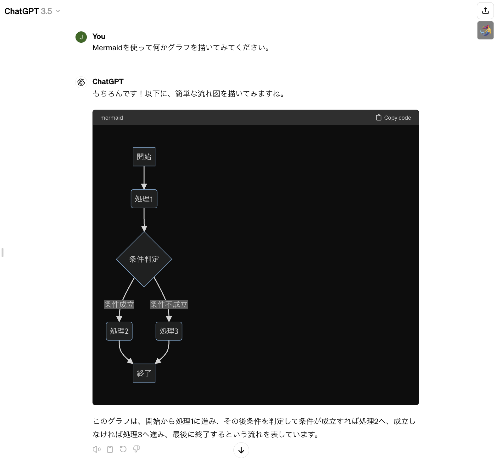

## What's this
ChatGPTが出力したMermaid形式のコードをビジュアライズ/解除するブックマークレットです。
Bookmarklet to visualize/unvisualize Mermaid format code output by ChatGPT.

インストール方法が普通のブックマークレットと少し異なります。install-and-usage.htmlをブラウザで開いて見てください。
The installation procedure is a little different from the usual bookmarklet; open install-and-usage.html in your browser and look at it.

[install-and-usage](https://sou3ilow.github.io/chatgpt-mermaid-bookmarklet/install-and-usage.html)

Sample.pngは動作の様子をキャプチャしたものです。右上に人魚のボタン、Mermaidコードが表示されるべき部分がビジュアル化されています。
Sample.png is a capture of the operation. The mermaid button is visualized in the upper right corner, where the Mermaid code should appear.

[Test](javascript:%28function%28%29%7Blet%20isRendered%3D!1%3Bconst%20label%3D%22%F0%9F%A7%9C%E2%80%8D%E2%99%80%EF%B8%8F%EF%B8%8F%22%2Cversion%3D%22ver.%202024%20Apr%2030%22%2CstorageName%3D%22mermaidScript%22%2CstorageDate%3D%22mermaidScriptDate%22%2Cselector%3D%22code.language-mermaid%22%3Bfunction%20listupTargets%28e%3Ddocument.body%29%7Bconst%20t%3D%5B%5D%3Bt.push%28...e.querySelectorAll%28selector%29%29%3Breturn%20e.querySelectorAll%28%22*%22%29.forEach%28%28e%3D%3E%7Be.shadowRoot%26%26t.push%28...listupTargets%28e.shadowRoot%29%29%7D%29%29%2Ct%7Dfunction%20render%28%29%7Blet%20e%3DlistupTargets%28%29%3Be.forEach%28%28e%3D%3E%7Be.dataset.original%3De.textContent%7D%29%29%2Cmermaid.run%28%7Bnodes%3Ae%2CsuppressErrors%3A!0%7D%29%2CisRendered%3D!0%2Cconsole.info%28%60%24%7Blabel%7D%20rendered%60%29%7Dfunction%20restore%28%29%7BlistupTargets%28%29.forEach%28%28e%3D%3E%7Be.querySelectorAll%28%22svg%22%29.forEach%28%28e%3D%3E%7Be.remove%28%29%7D%29%29%2Ce.dataset.processed%26%26%28e.textContent%3De.dataset.original%2Cdelete%20e.dataset.processed%29%7D%29%29%2CisRendered%3D!1%2Cconsole.info%28%60%24%7Blabel%7D%20restored%60%29%7Dfunction%20loadScriptFromStorage%28%29%7Blet%20e%3DlocalStorage.getItem%28storageName%29%2Ct%3Dnew%20Date%28localStorage.getItem%28storageDate%29%29%3BloadScript%28e%29%2Cconsole.info%28%60%24%7Blabel%7D%20script%20loaded%20from%20localStorage.%24%7BstorageName%7D%2C%20stored%20on%20%24%7Bt.toISOString%28%29%7D%60%29%7Dfunction%20loadScript%28e%29%7Bwindow.mermaid%26%26delete%20window.mermaid%3Bconst%20t%3D%22mermaid-onthefly%22%3Blet%20o%3Ddocument.head.querySelector%28%22%23%22%2Bt%29%3Bo%26%26document.head.removeChild%28o%29%3Bconst%20r%3Ddocument.createElement%28%22script%22%29%3Br.id%3Dt%2Cr.textContent%3De%2Cdocument.head.appendChild%28r%29%2Cmermaid.initialize%28%7Btheme%3A%22dark%22%7D%29%7Dfunction%20setupDragDropListener%28e%29%7Be.addEventListener%28%22dragover%22%2C%28function%28t%29%7Bt.preventDefault%28%29%2Ce.classList.add%28%22dragover%22%29%7D%29%29%2Ce.addEventListener%28%22dragleave%22%2C%28function%28t%29%7Be.classList.remove%28%22dragover%22%29%7D%29%29%2Ce.addEventListener%28%22drop%22%2C%28function%28t%29%7Bt.preventDefault%28%29%2Ce.classList.remove%28%22dragover%22%29%3Bconst%20o%3Dt.dataTransfer.files%5B0%5D%3Bif%28!o%29return%3Bconst%20r%3Dnew%20FileReader%3Br.onload%3Dfunction%28e%29%7Bnew%20Date%3BloadScript%28e.target.result%29%3Bconsole.info%28%60%24%7Blabel%7D%20Script%20is%20reloaded.%60%29%2Cwindow.alert%28%22Script%20is%20reloaded.%22%29%7D%2Cr.readAsText%28o%29%7D%29%29%7Dfunction%20setup%28%29%7BlocalStorage.getItem%28storageName%29%26%26loadScriptFromStorage%28%29%3Bconst%20e%3D%22mermaidButton%22%3Bif%28document.querySelector%28%22%23%22%2Be%29%29%3Belse%7Blet%20t%3Ddocument.createElement%28%22style%22%29%3Bdocument.head.appendChild%28t%29%2Ct.sheet.insertRule%28%60%23%24%7Be%7D%20%7B%5Cn%20%20%20%20%20%20%20%20%20%20%20%20%20%20%20%20display%3A%20inline%20!important%3B%5Cn%20%20%20%20%20%20%20%20%20%20%20%20%20%20%20%20position%3A%20fixed%3B%5Cn%20%20%20%20%20%20%20%20%20%20%20%20%20%20%20%20top%3A%2050px%3B%5Cn%20%20%20%20%20%20%20%20%20%20%20%20%20%20%20%20right%3A%2020px%3B%5Cn%20%20%20%20%20%20%20%20%20%20%20%20%20%20%20%20font-size%3A%2018pt%3B%5Cn%20%20%20%20%20%20%20%20%20%20%20%20%20%20%20%20border%3A%201px%20solid%20lightgray%3B%5Cn%20%20%20%20%20%20%20%20%20%20%20%20%20%20%20%20border-radius%3A%205px%3B%5Cn%20%20%20%20%20%20%20%20%20%20%20%20%20%20%20%20padding%3A%201px%205px%3B%5Cn%20%20%20%20%20%20%20%20%20%20%20%20%7D%60%2Ct.sheet.cssRules.length%29%2Ct.sheet.insertRule%28%60%23%24%7Be%7D.dragover%20%7B%5Cn%20%20%20%20%20%20%20%20%20%20%20%20%20%20%20%20background-color%3A%20pink%3B%5Cn%20%20%20%20%20%20%20%20%20%20%20%20%7D%60%2Ct.sheet.cssRules.length%29%3Blet%20o%3Ddocument.createElement%28%22button%22%29%3Bo.id%3De%2Co.textContent%3Dlabel%2CsetupDragDropListener%28o%29%2Cdocument.body.appendChild%28o%29%2Co.addEventListener%28%22click%22%2C%28function%28%29%7Bif%28!window.mermaid%29%7Bconst%20e%3D%22Mermaid%20is%20not%20loaded.%20Please%20follow%20the%20steps%20below%20to%20set%20it%20up.%5Cn%5Cn1.%20Download%20Mermaid%20JS%20from%20https%3A%2F%2Fcdn.jsdelivr.net%2Fnpm%2Fmermaid%2Fdist%2Fmermaid.min.js%5Cn2.%20Drag%20%26%20drop%20the%20script%20file%20on%20the%20mermaid%20button%20on%20this%20page.%22%3Bthrow%20window.alert%28e%29%2Ce%7DisRendered%3F%28restore%28%29%2Co.style.backgroundColor%3D%22white%22%29%3A%28render%28%29%2Co.style.backgroundColor%3D%22gray%22%29%7D%29%29%7Dlet%20t%3DlocalStorage.getItem%28storageDate%29%3Bconsole.info%28%60%24%7Blabel%7D%20hello!%20bookmarklet%3A%24%7Bversion%7D%20script%3A%20%24%7Bt%7D%60%29%7Dsetup%28%29%3B%7D%29%28%29)
