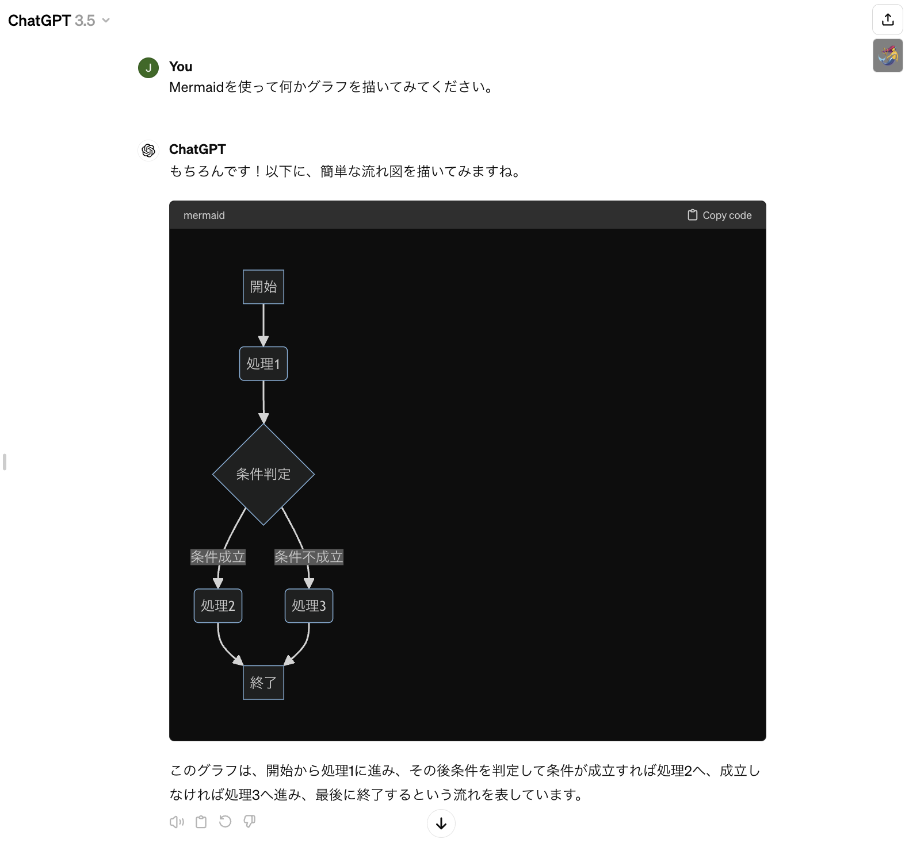

## What's this
ChatGPTが出力したMermaid形式のコードをビジュアライズ/解除するブックマークレットです。
Bookmarklet to visualize/unvisualize Mermaid format code output by ChatGPT.

インストール方法が普通のブックマークレットと少し異なります。install-and-usage.htmlをブラウザで開いて見てください。
The installation procedure is a little different from the usual bookmarklet; open install-and-usage.html in your browser and look at it.

[install-and-usage](install-and-usage.html)

Sample.pngは動作の様子をキャプチャしたものです。右上に人魚のボタン、Mermaidコードが表示されるべき部分がビジュアル化されています。
Sample.png is a capture of the operation. The mermaid button is visualized in the upper right corner, where the Mermaid code should appear.

